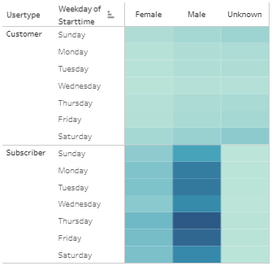

# BikeSharing
## Overview
### Purpose
The purpose of this project is to analyze the Citi Bike data from NYC and see if we can identify trends that could determine if the same system could be profitable in Des Moines. After using Pandas to format data types, Tableau was used to create a series of visualizations to demonstrate patterns in the data. Finally, those visualizations are placed into a Tableau Story to help tell the story behind the data.
## Results
### Tableau Story Link
[Click to view my Citi Bike Story](https://public.tableau.com/app/profile/clay.manwaring/viz/Challenge14_16239124089400/CitiBikeStory)
### Checkout Times for Users
  
Most of the users have a bike checked out for less than 30 minutes. Most bikes are checked out for just 5 minutes.
### Checkout Times by Gender
 
Most of the Citi Bike users are Male. Male peak checkout time is 5 minutes, whereas Female peak checkout time is 6 minutes; with a similar distribution to the last chart.
### August Peak Hours
 
Peak hours are similar to roadway traffic patterns in that they are busiest before and after standard work hours. It appears that many of the users may be using the bikes to commute to and from work.
### Trips by Weekday for Each Hour
 
During the week, more bikes are used from 7 to 10 a.m. and 5 to 8 p.m.; whereas the weekends see checkouts range from 9 a.m. to 7 p.m. This would indicate people using the bikes both for commuting to work and for leisure on the weekends. It would seem that people are opting out of driving their vehicles, and are instead using the bikes to commute to work. The 5 minute peak duration time could possibly support this theory.
### Trips by Gender per Weekday Hour
 
The main thing that stands out to me on this chart is that the 'Unknown' gender has more checkouts on the weekends than during the week, contrary to the other two charts. I would be inclined to think that the 'Unknown' gender is a placeholder for Customers and do not enter gender information, and are just looking for a leisurely ride on the weekend.
### User Type
 
There are significantly more Subscribers than there are Customers.
### User Trips by Gender by Weekday
 
Most of the uses come from male subscribers during the week. Most of the Customers uses are 'Unknown' gender on Saturday and Sunday. This chart also shows that there are very few Subscribers with 'Unknown' gender.
## Summary
### Analysis
It would seem that the majority of clientelle are Male Subscribers that are commuting to and from work; and probably live fairly close to their place of employment, indicated by the peak duration being just 5 minutes. On the weekends, the hours of use are distributed much differently throughout the day; showing broad uses throughout the entire day, but never to the level of intensity shown just outside of business hours during the week.
### Thinking Forward
I would be interested to see maps showing the starting and ending locations of bike uses between a 3 and 8 minute duration. Then I would also like to see maps showing the starting and ending locations of bike uses during the peak hours during the week. This may reveal demographics of areas where uses are highest. Finally I would be very interested to see a chart demonstrating what percent of total uses fit into these durations and time ranges.
